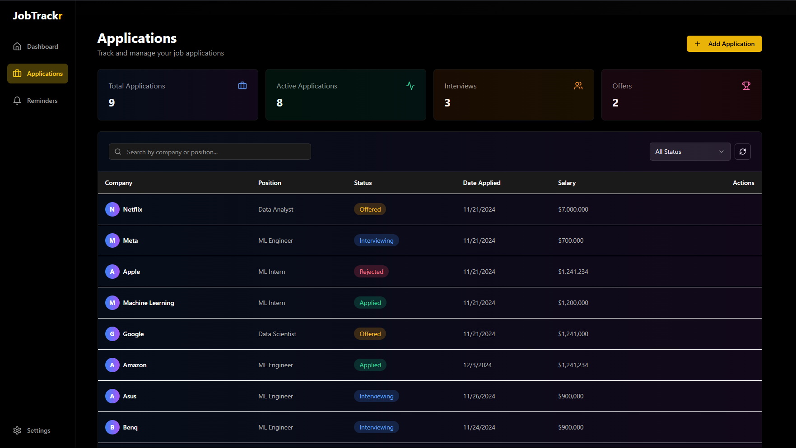
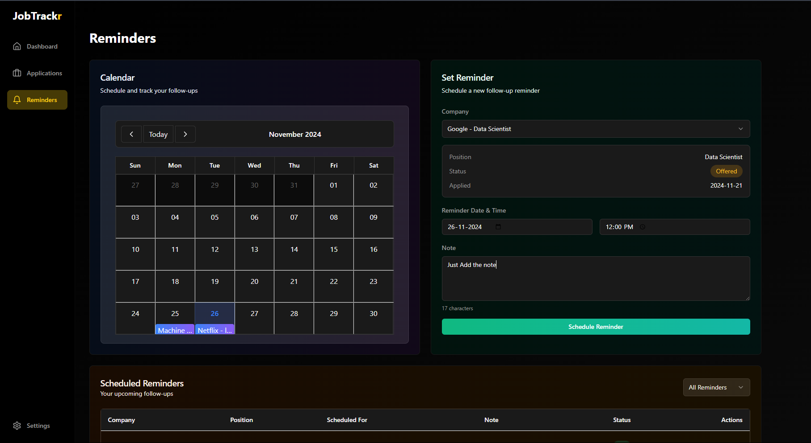

# <div align="center"></div>

<div align="center">


<br/>
<br/>


<h2>
  
</h2>

<p align="center">
  <em>Track applications, set reminders, store resumes, and access your data seamlessly with Google Drive integration.</em>
</p>


</div>

##  **What is JobTrackr?**

**JobTrackr** is a modern, intuitive job tracking tool designed to streamline your job application process. Built with job seekers in mind, it helps you stay organized, efficient, and productive throughout your job search journey.

<div align="center">

### 🎯 **Core Features**

<table>
<tr>
<td align="center"><br/><b>Dashboard</b></td>
<td>A clean, intuitive overview of all your job applications and reminders</td>
</tr>
<tr>
<td align="center"><br/><b>Application Tracker</b></td>
<td>Track applications with statuses: <i>Applied</i>, <i>Interviewing</i>, <i>Offered</i>, <i>Rejected</i></td>
</tr>
<tr>
<td align="center"><br/><b>Reminder System</b></td>
<td>Smart reminders for interviews, follow-ups, and deadlines</td>
</tr>
<tr>
<td align="center"><br/><b>Google Drive Integration</b></td>
<td>Seamless document storage and access</td>
</tr>
<tr>
<td align="center"><br/><b>AWS SES Notifications</b></td>
<td>Automated email reminders and updates</td>
</tr>
</table>


</div>


##  **Getting Started**

### **Prerequisites**

<table>
<tr>
<td></td>
<td>Node.js (v14 or higher)</td>
</tr>
<tr>
<td></td>
<td>npm/yarn</td>
</tr>
<tr>
<td></td>
<td>Git</td>
</tr>
<tr>
<td></td>
<td>Firebase account</td>
</tr>
<tr>
<td></td>
<td>Google Cloud account</td>
</tr>
<tr>
<td></td>
<td>AWS account</td>
</tr>
</table>

### **1️⃣ Clone & Install**

```bash
# Clone the repository
git clone https://github.com/phantombeast7/JobTrackr.git
cd JobTrackr

# Install dependencies
npm install
```

### **2️⃣ Firebase Setup**

<details>
<summary>🔥 Click to expand Firebase setup instructions</summary>

#### **Create Firebase Project**

1. Visit [Firebase Console](https://console.firebase.google.com/)
2. Create new project
3. Navigate to Project Settings

#### **Firebase Configuration**

```javascript
const firebaseConfig = {
  apiKey: YOUR_API_KEY, 
  authDomain: YOUR_AUTH_DOMAIN,
  projectId: YOUR_PROJECT_ID,
  storageBucket: YOUR_STORAGE_BUCKET,
  messagingSenderId: YOUR_MESSAGING_SENDER_ID,
  appId: YOUR_APP_ID,
  measurementId: YOUR_MEASUREMENT_ID
};
```

#### **Environment Variables**

Create `.env.local`:

```env
NEXT_PUBLIC_FIREBASE_API_KEY=YOUR_API_KEY
NEXT_PUBLIC_FIREBASE_AUTH_DOMAIN=YOUR_AUTH_DOMAIN
NEXT_PUBLIC_FIREBASE_PROJECT_ID=YOUR_PROJECT_ID
NEXT_PUBLIC_FIREBASE_STORAGE_BUCKET=YOUR_STORAGE_BUCKET
NEXT_PUBLIC_FIREBASE_MESSAGING_SENDER_ID=YOUR_MESSAGING_SENDER_ID
NEXT_PUBLIC_FIREBASE_APP_ID=YOUR_APP_ID
NEXT_PUBLIC_FIREBASE_MEASUREMENT_ID=YOUR_MEASUREMENT_ID

FIREBASE_PROJECT_ID=YOUR_PROJECT_ID
FIREBASE_CLIENT_EMAIL=YOUR_CLIENT_EMAIL
FIREBASE_PRIVATE_KEY=YOUR_PRIVATE_KEY
```

#### **Firestore Rules**

```javascript
rules_version = '2';
service cloud.firestore {
  match /databases/{database}/documents {
    // Helper functions
    function isSignedIn() {
      return request.auth != null;
    }

    function isOwner(userId) {
      return request.auth.uid == userId;
    }

    function isValidApplication() {
      let data = request.resource.data;
      return data.userId == request.auth.uid &&
             data.companyName is string &&
             data.jobTitle is string &&
             data.status in ['Applied', 'Interviewing', 'Offered', 'Rejected'] &&
             data.applicationDate is string;
    }

    function isValidReminder() {
      let data = request.resource.data;
      return data.userId == request.auth.uid &&
             data.type in ['interview', 'followup'] &&
             data.date is string &&
             data.message is string;
    }

    // Users collection
    match /users/{userId} {
      allow read, write: if isSignedIn() && isOwner(userId);
      
      // Allow reading user settings
      match /settings/{settingId} {
        allow read: if isSignedIn() && isOwner(userId);
        allow write: if isSignedIn() && isOwner(userId);
      }
    }
    
    // Applications collection
    match /applications/{applicationId} {
      // Allow read operations
      allow list: if isSignedIn();
      allow get: if isSignedIn() && resource.data.userId == request.auth.uid;
      
      // Allow create with validation
      allow create: if isSignedIn() && isValidApplication();
      
      // Allow update and delete for document owner
      allow update: if isSignedIn() && 
                   resource.data.userId == request.auth.uid &&
                   isValidApplication();
      allow delete: if isSignedIn() && resource.data.userId == request.auth.uid;
    }

    // Reminders collection
    match /reminders/{reminderId} {
      allow read: if isSignedIn() && 
                 (resource == null || resource.data.userId == request.auth.uid);
      allow create: if isSignedIn() && isValidReminder();
      allow update, delete: if isSignedIn() && 
                          resource.data.userId == request.auth.uid;
    }

    // Blacklisted Companies collection
    match /blacklistedCompanies/{companyId} {
      // Anyone signed in can read blacklisted companies
      allow read: if isSignedIn();
      // Blacklisted Companies collection
  
      // Users can create reports
      allow create: if isSignedIn() && 
                   request.resource.data.reportedBy == request.auth.uid &&
                   request.resource.data.companyName is string &&
                   request.resource.data.reason is string;
      
      // Only the reporter can update their report
      allow update: if isSignedIn() && 
                   resource.data.reportedBy == request.auth.uid &&
                   resource.data.status == 'pending';
                   
      // Allow delete for the reporter
  		allow delete: if isSignedIn() && resource.data.reportedBy == request.auth.uid;
    }

    // Default rule - deny everything else
    match /{document=**} {
      allow read, write: if false;
    }
    // Reminders collection
    match /reminders/{reminderId} {
      allow read: if request.auth != null && 
                 resource.data.userId == request.auth.uid;
      
      allow create: if request.auth != null && 
                   request.resource.data.userId == request.auth.uid;
      
      allow update: if request.auth != null && 
                   resource.data.userId == request.auth.uid;
      
      allow delete: if request.auth != null && 
                   resource.data.userId == request.auth.uid;
    }
  }
}
```

#### **Firestore Indexes**

Required indexes:
```javascript
Collection ID	Fields indexed                          Query scope                                             Status	
applications	userId Ascending resumeUrl    Ascending __name__ Ascending	Collection		                      Enabled	
applications	userId Ascending createdAt    Descending __name__ Descending	Collection		                    Enabled	
reminders	    sent   Ascending userId       Ascending scheduledFor Ascending __name__ Ascending	Collection		Enabled	
reminders	    userId Ascending scheduledFor Descending __name__ Descending	Collection	                    	Enabled
```

</details>

### **3️⃣ Google Drive Setup**

<details>
<summary>📁 Click to expand Google Drive setup instructions</summary>

1. Visit [Google Cloud Console](https://console.cloud.google.com/)
2. Enable Google Drive API
3. Create OAuth 2.0 credentials
4. Configure redirect URIs:

```bash
# Local
http://localhost:3000
http://localhost:3000/api/auth/google-drive/callback

# Production
https://jobtrackr7.netlify.app/
https://jobtrackr7.netlify.app/api/auth/google-drive/callback
```

5. Add to `.env.local`:

```env
NEXT_PUBLIC_GOOGLE_DRIVE_CLIENT_ID=YOUR_GOOGLE_DRIVE_CLIENT_ID
GOOGLE_DRIVE_CLIENT_SECRET=YOUR_GOOGLE_DRIVE_CLIENT_SECRET
NEXT_PUBLIC_GOOGLE_DRIVE_REDIRECT_URI=http://localhost:3000/api/auth/google-drive/callback
```

</details>

### **4️⃣ AWS SES Setup**

<details>
<summary>📧 Click to expand AWS SES setup instructions</summary>

1. Access [AWS Console](https://aws.amazon.com/console/)
2. Configure SES:
   - Create Email Identity
   - Set up SMTP credentials
3. Add to `.env.local`:

```env
AWS_SES_SMTP_HOST=YOUR_SMTP_HOST
AWS_SES_SMTP_PORT=YOUR_SMTP_PORT
AWS_SES_USER=YOUR_SMTP_USER
AWS_SES_PASSWORD=YOUR_SMTP_PASSWORD
AWS_SES_FROM_EMAIL=YOUR_VERIFIED_EMAIL
```

</details>


##  **Preview**

<div align="center">

### 🎯 **Dashboard Overview**


### 📝 **Application Tracking**


### ⏰ **Smart Reminders**


</div>


## 🤝 **Contributing**


We love contributions! Here's how you can help:

1. 🍴 Fork the repository
2. 🌿 Create your feature branch
3. ✍️ Commit your changes
4. 🚀 Push to the branch
5. 🎉 Open a Pull Request

See our [Contributing Guidelines](CONTRIBUTING.md) for more details.


## 📄 **License**

This project is licensed under the MIT License - see the [LICENSE](LICENSE) file for details.


<div align="center">

### 🎯 **Ready to streamline your job search?**

<a href="https://jobtrackr7.netlify.app/">
  
</a>

<a href="https://github.com/phantombeast7/JobTrackr/issues">
  
</a>

<a href="https://github.com/phantombeast7/JobTrackr/issues">
  
</a>


<br/>
<br/>

<a href="https://github.com/phantombeast7">
  <p style="font-family: 'Fira Code', monospace; font-size: 30px; text-align: center; color: white; 
            background: linear-gradient(90deg, #00C7B7, #FF5733, #FFC300);
            background-clip: text; -webkit-background-clip: text; 
            animation: glow 1.5s ease-in-out infinite;">
    Made with ❤️ by phantombeast7
  </p>
</a>

<style>
  @keyframes glow {
    0% {
      text-shadow: 0 0 10px #00C7B7, 0 0 20px #FF5733, 0 0 30px #FFC300;
    }
    50% {
      text-shadow: 0 0 15px #00C7B7, 0 0 25px #FF5733, 0 0 35px #FFC300;
    }
    100% {
      text-shadow: 0 0 20px #00C7B7, 0 0 30px #FF5733, 0 0 40px #FFC300;
    }
  }
</style>


</div>
